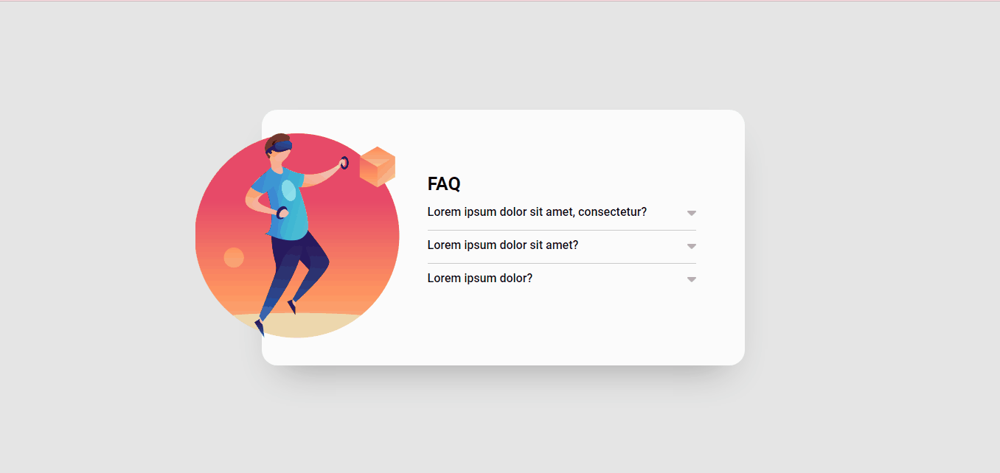

# Criar um acordeon

## Descrição

Exercício desenvolvido no curso DevQuest, onde deveriamos criar uma página com acordeon feito no javascript. O design foi tirado do Figma.

## Objetivo

Ao clicar em uma pergunta deverá acontecer
uma animação de acordeon para abrir o item
e mostrar o texto escondido, e a seta deve
mudar de cor.
Ao clicar em um item para abri-lo todos os
outros itens devem ser fechados.

## Técnologias utilizadas 

- HTML
- CSS
- JavaScript

## Layout

## Desafio

Foi desafiador a parte de pensar como esconder e mostrar as resposta mas de forma simples cheguei ao objetivo, confesso que não é uma linguagem fácil para quem está começando, mas com a prática podemos melhorar. 
No fim ficou incrivel.